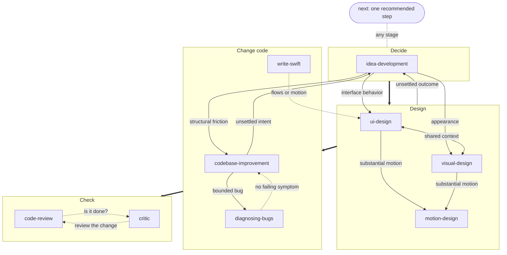

# skills

Ten focused skills distilled from the pinned source corpus: eight core jobs and
two specialists. Each owns a useful outcome; investigation, prototypes and
verification support that outcome without becoming a chain of prerequisite skills.

| Skill | Say something like | Leaves behind |
| --- | --- | --- |
| [**idea-development**](skills/idea-development/SKILL.md) | "Help me develop this idea." | A shared vision, the decisions behind it, and a plan |
| [**codebase-improvement**](skills/codebase-improvement/SKILL.md) | "Help me improve this codebase." | A justified structure and plan, with implementation when requested |
| [**visual-design**](skills/visual-design/SKILL.md) | "Let's find the visual direction." | A chosen look, expressed as concrete values |
| [**ui-design**](skills/ui-design/SKILL.md) | "Help me design this interface." | Agreed flows, states, and interactions |
| [**next**](skills/next/SKILL.md) | "What's next?" | One recommended step and why, from what already exists |
| [**diagnosing-bugs**](skills/diagnosing-bugs/SKILL.md) | "Fix this regression." | A cause and a fix with failing-before/passing-after evidence |
| [**code-review**](skills/code-review/SKILL.md) | "Check the latest changes." | Findings against intent and repository standards |
| [**critic**](skills/critic/SKILL.md) | "Is this work actually done?" | A pass, failure or unverified verdict backed by observed evidence |
| [**motion-design**](skills/motion-design/SKILL.md) | "Make this interaction feel right." | Purposeful, interruptible motion and observed checks |
| [**write-swift**](skills/write-swift/SKILL.md) | "Fix this SwiftUI lifecycle bug." | Swift changes checked against the project's toolchain and state boundaries |

## How the skills work

Collections of small skills make you ask "which skill is next?". These are named
after the work you already know you're starting, not after the techniques inside
it. Questioning, research, prototypes, and decision notes are tools each skill
reaches for when they help, not steps you have to sequence.

The decision and design skills share a collaboration pattern:

- **Look before asking.** The agent reads what it can find before spending your
  attention.
- **Something concrete to disagree with.** Usage examples, before/after
  structure, working prototypes, not abstract questions.
- **Real options, honest costs.** Genuinely different alternatives, each with
  when it wins and what it costs. You choose.
- **A handoff, not a transcript.** Decisions and plans someone else can build
  from without replaying the conversation.

Debugging, reviewing and checking completion each have their own outcome.
Motion and Swift add specialist knowledge when the work needs it. Helpers are
optional; an absent sibling does not block the requested work. **next** recommends
from the actual remaining gap rather than imposing a skill sequence.

Visual design and UI design are separate skills because "how it looks" and "how
it works" are different questions, but they share context and hand off to each
other mid-conversation.



Thick arrows are the usual direction of work, not a required sequence. Solid
arrows are handoffs a skill makes when the work turns out to belong elsewhere;
dashed arrows are "use this instead" redirects. Every handoff carries the
context across rather than restarting discovery. **next** reads where the work
stands and points at whichever skill closes the most consequential gap.

## Install

Each skill is a folder with a `SKILL.md`, the format used by Claude Code, Codex,
Cursor, pi, and other agent harnesses. Copy or symlink the folders you want into
your harness's skills directory, for example:

```sh
git clone https://github.com/sxnzs/skills
mkdir -p ~/.claude/skills
for s in "$PWD"/skills/skills/*; do ln -s "$s" ~/.claude/skills/; done
```

Requests for discussion, options or plans stop at that deliverable. When the
user also asks to implement a settled direction, the workflow carries the work
through its checks without asking for the same approval again. A genuine open
product or taste decision stays with the user. **next** only recommends;
review-only requests report findings; **critic** verifies without repairing.

The skill bodies stay portable across capable models. Model IDs, effort and
measured workarounds belong in the harness or [model calibration notes](evals/MODELS.md),
not in a separate copy of every skill. Motion and Swift disclose their specialist
references only when the task needs them.

## Verify

Use Node 24 or newer and Python 3; no dependency installation is required.
The Swift example is compiled with strict concurrency when `swiftc` is installed;
otherwise that check is explicitly skipped. Motion controller checks use Node.

```sh
npm run check
```

The dependency-free TypeScript checker supports flat scalar frontmatter and
inline Markdown links, not general YAML or Markdown. It runs regression tests
and checks skill metadata, sibling references, and documentation links.
[Behavioral cases](evals/README.md) describe separate observations in disposable
fixtures; the structural checker does not prove agent behavior.

## Lineage

These skills were written after studying first-party skills by
[@poteto](https://github.com/cursor/plugins/tree/main/pstack),
[@dexhorthy](https://github.com/humanlayer/skills), and
[@emilkowalski](https://github.com/emilkowalski/skills), and the collection by
[@mattpocock](https://github.com/mattpocock/skills). What we took from each is
in [LINEAGE.md](LINEAGE.md). No source text is copied beyond short attributed
quotes.

## License

MIT
