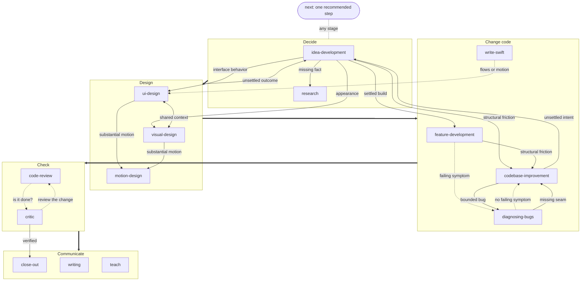

# How the skills fit together

Each skill has a page in this folder: what it does, when to reach for it, what
"working" looks like, and where it hands off.

| Bucket | Skills |
| --- | --- |
| Engineering | [feature-development](engineering/feature-development.md), [diagnosing-bugs](engineering/diagnosing-bugs.md), [codebase-improvement](engineering/codebase-improvement.md), [code-review](engineering/code-review.md), [critic](engineering/critic.md), [write-swift](engineering/write-swift.md) |
| Design | [idea-development](design/idea-development.md), [ui-design](design/ui-design.md), [visual-design](design/visual-design.md), [motion-design](design/motion-design.md) |
| Productivity | [research](productivity/research.md), [writing](productivity/writing.md), [teach](productivity/teach.md), [close-out](productivity/close-out.md), [next](productivity/next.md) |

## The collaboration pattern

Collections of small skills make you ask "which skill is next?". These are named
after the work you already know you're starting, not after the techniques inside
it. Questioning, research, prototypes, and decision notes are tools each skill
reaches for when they help, not steps you have to sequence.

The decision and design skills share a collaboration pattern:

- **Look before asking.** The agent reads what it can find before spending your
  attention.
- **Something concrete to disagree with.** Usage examples, before/after
  structure, working prototypes, not abstract questions.
- **Real options, honest costs.** Genuinely different alternatives, each with
  when it wins and what it costs. You choose.
- **A handoff, not a transcript.** Decisions and plans someone else can build
  from without replaying the conversation.

Debugging, reviewing and checking completion each have their own outcome.
Motion and Swift add specialist knowledge when the work needs it. Helpers are
optional; an absent sibling does not block the requested work. **next** recommends
from the actual remaining gap rather than imposing a skill sequence.

Visual design and UI design are separate skills because "how it looks" and "how
it works" are different questions, but they share context and hand off to each
other mid-conversation.

Thick arrows are the usual direction of work, not a required sequence. Solid
arrows are handoffs a skill makes when the work turns out to belong elsewhere;
dashed arrows are "use this instead" redirects. Every handoff carries the
context across rather than restarting discovery. **next** reads where the work
stands and points at whichever skill closes the most consequential gap.
